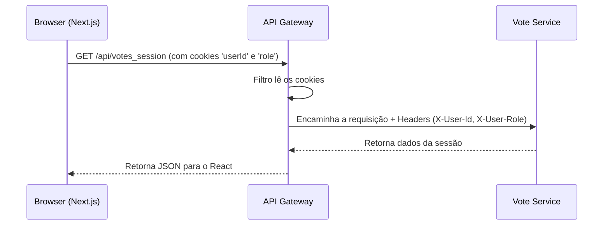

# 🚀 Frontend - Sistema de Votação "Monopólio"

Esta é a aplicação frontend para o Sistema de Votação, desenvolvida com **Next.js** e **TypeScript**. Ela serve como a interface do usuário para interagir com a arquitetura de microsserviços, oferecendo painéis distintos e funcionalidades específicas para usuários comuns e administradores.

A aplicação é totalmente reativa, se comunica com o backend através do API Gateway e foi projetada para ser implantada de forma independente na **Render**.
**[Aplicação ao Vivo](https://www.meuvoto.giize.com/)**


-----

## ✅ Funcionalidades Principais

### Para Usuários (`USER`)

  - **Dashboard Intuitivo:** Visualização de todas as sessões de votação disponíveis, com filtros por status (Ativas, Encerradas, etc.).
  - **Votação Simplificada:** Interface modal para registrar votos em sessões ativas.
  - **Visualização de Resultados:** Gráficos e tabelas detalhadas para sessões já encerradas.
  - **Histórico de Participação:** Acompanhamento das sessões em que o usuário já votou.

### Para Administradores (`ADMIN`)

  - **Painel de Controle Central:** Dashboard com estatísticas gerais (total de usuários, sessões ativas, etc.).
  - **Gerenciamento de Sessões:**
      - Criação de novas sessões de votação com título, descrição, datas e opções customizadas.
      - Visualização e exclusão de sessões existentes.
      - Acesso aos resultados de qualquer sessão encerrada.
  - **Gerenciamento de Usuários:**
      - Listagem de todos os usuários cadastrados no sistema.
      - Busca por nome ou e-mail.
      - Exclusão de usuários.

### Funcionalidades Gerais

  - **Autenticação Segura:** Telas de Login e Registro.
  - **Roteamento Protegido:** Acesso a páginas e funcionalidades baseado no perfil do usuário (`ADMIN` ou `USER`).
  - **Layout Responsivo:** Interfaces adaptáveis para desktop e mobile.
  - **Feedback ao Usuário:** Notificações (toasts) para ações como sucesso ou erro.

-----

## 🏗️ Arquitetura e Fluxo de Autenticação

O frontend **não armazena tokens JWT ou gerencia a lógica de autenticação complexa**. Ele opera de forma stateless, dependendo inteiramente do **API Gateway** para orquestrar a sessão do usuário através de **cookies**.

1.  **Login:** O usuário envia email e senha. A requisição vai para o API Gateway, que a repassa ao `user-service`. Se as credenciais estiverem corretas, o **Gateway** define os cookies `userId` e `role` no navegador.
2.  **Gerenciamento da Sessão:** O `AuthContext` (React Context API) no frontend lê esses cookies para determinar se o usuário está logado e qual é o seu perfil, liberando o acesso às rotas protegidas.
3.  **Requisições Autenticadas:** Para qualquer chamada à API (ex: buscar sessões, votar), o `axios` é configurado com `withCredentials: true`, garantindo que os cookies sejam enviados automaticamente. O Gateway os intercepta, valida e os traduz para headers (`X-User-Id`, `X-User-Role`) que os microsserviços entendem.

<!-- end list -->



-----

## ⚙️ Tecnologias Utilizadas

| Categoria | Tecnologias |
| :--- | :--- |
| **Framework** | Next.js 13+, React 18 |
| **Linguagem** | TypeScript |
| **Comunicação API**| Axios |
| **Estado Global** | React Context API |
| **Estilização** | CSS Global + Scoped CSS (`<style jsx>`) |
| **Ícones** | React Icons (Feather Icons) |

-----

## 🚀 Como Rodar Localmente

**1. Pré-requisitos:**

  * Node.js (v18 ou superior)
  * npm ou yarn

**2. Clone o repositório:**

```bash
git clone https://github.com/seu-usuario/voting-system-frontend.git
cd voting-system-frontend
```

**3. Instale as dependências:**

```bash
npm install
# ou
yarn install
```

**4. Configure as variáveis de ambiente:**
Crie um arquivo chamado `.env.local` na raiz do projeto e adicione a URL do seu API Gateway. Para desenvolvimento local, ele geralmente estará na porta 8080.

```env
NEXT_PUBLIC_API_URL=http://localhost:8080
```

**5. Rode o servidor de desenvolvimento:**

```bash
npm run dev
# ou
yarn dev
```

A aplicação estará disponível em `http://localhost:3000`.

-----

## 📂 Estrutura de Pastas

```
/
├── components/       # Componentes React reutilizáveis (modais, layouts, etc.)
├── contexts/         # React Contexts (ex: AuthContext)
├── hooks/            # Hooks customizados (ex: useVoteResults)
├── pages/            # Rotas da aplicação (mapeamento 1:1 com a URL)
│   ├── api/          # Rotas de API do Next.js (se houver)
│   ├── dashboard/    # Páginas protegidas (admin, user)
│   └── index.tsx     # Página de Login
├── services/         # Configuração de serviços externos (ex: api.ts com axios)
├── styles/           # Arquivos de estilo globais (ex: globals.css)
├── types/            # Definições de tipos TypeScript
└── utils/            # Funções utilitárias (cookies, normalização)
```

-----

## 📝 Pendências e Próximos Passos

  - [ ] **Refatoração de Estilos:** A maior pendência técnica é a criação de um sistema de design mais robusto e a refatoração dos estilos. O objetivo é:
      - Criar componentes de UI genéricos e reutilizáveis (Botões, Inputs, Cards).
      - Adotar uma estratégia de estilização mais escalável (CSS Modules, Tailwind CSS ou Styled-Components).
      - Definir um tema global (cores, fontes, espaçamentos) para garantir consistência visual.
  - [ ] **Implementação de Testes:** Adicionar testes unitários (Jest/React Testing Library) e testes E2E (Cypress/Playwright) para garantir a qualidade e a estabilidade da aplicação.
  - [ ] **Otimização de Performance:** Utilizar funcionalidades avançadas do Next.js como `Image` para otimização de imagens e analisar o bundle para possíveis melhorias.
